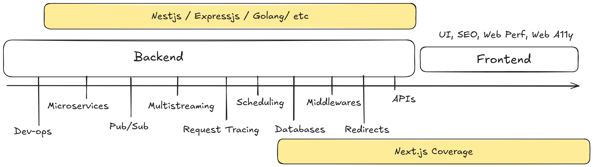

This is a [Next.js 15](https://nextjs.org) crash course taught by Code Dusting on:
1. Twitch: https://twitch.tv/codedusting
2. Kick: https://kick.com/codedusting
3. YouTube: https://youtube.com/live/YR76Q6a1imo?feature=share

## Written Tutorial

1. Intro
2. Context
  
4.
